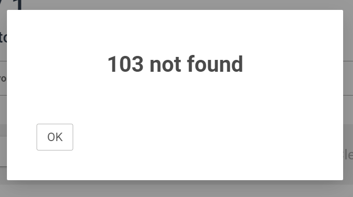

# TOY Project
## 개인별 ToDO List 웹어플리케이션을 만들어 BoA요.

## 결과물
- Vue.js을 사용한 Front-End
- SpringBoot 을 사용한 Back-End

## 참고 화면 디자인
https://www.newbiecraft.com/

## User Story
- 사용자는 사용자별 할일을 관리하기 위해서 사용자의 이름을 입력하고 싶다.
    - when: 어플리케이션을 시작하면<br/>
      then: 왼쪽 상단에 Title 이 보여진다.<br/>
      and then: 오른쪽 상단에 현재 날짜와 요일이 보여진다.<br/>
      and then: 인사말이 보여진다.<br/>
      and then: 사용자의 이름을 입력하는 필드와 버튼이 보여진다.<br/>
      <br/>


<br/>

- 사용자는 사용자의 할 일 목록을 확인하고 싶다.<br/>
    given: 새로운 사용자의 이름이 존재한다. <br/>
    when: 사용자의 이름을 입력하고 버튼 혹은 엔터를 누르면<br/>
    then: 할일 목록 화면으로 이동한다. <br/>
    and then: 상단의 Title 과 날짜가 보여진다. <br/>
    and then: Good Morning/Afternoon/Evening 인사말과 사용자의 이름이 보여진다.<br/>
      <br/>
      
      <br/>
      <br/>
    
    given: 한번 사용된 사용자의 이름이 존재한다.<br/>
    when: 한번 사용된 사용자의 이름을 입력하고 버튼 혹은 엔터를 누르면<br/>
    then: 기존 사용자의 할일 목록 화면으로 이동한다. <br/>
    and then: 상단의 Title 과 날짜가 보여진다. <br/>
    and then: Good Morning/Afternoon/Evening 인사말과 사용자의 이름이 보여진다.<br/>
    and then: 완료되지 않은 할 일의 숫자와 완료된일을 포함한 총 할일의 숫자가 보여진다.<br/>
    and then: 가장 오래전에 추가된 할 일 순서로 목록이 정렬된다.<br/>
    and then: 목록의 각 항목에는 할 일의 내용과 추가된 날짜가 표시된다.<br/>
      <br/>
      
      <br/><br/>

    given: 사용자의 할일 목록이 보여진다.<br/>
    when: 브라우져 시작 혹은 브라우져 탭을 새로 시작하면 <br/>
    then: 새로운 사용자의 이름을 입력하는 화면이 보여진다.<br/>
          (sessionStorage를 사용하도록 한다.)<br/>
    <br/>
    given: 사용자가 존재하지 않는다.<br/>
    when: 할일 목록 화면이 보여지면 <br/>
         (postman 을 통해서 invalid user id를 통한 목록 요청시 exception 처리)<br/>
    then: 서버의 에러 메세지인 사용자가 존재하지 않는다는 에러화면을 보여준다.<br/> 
    <br/>
      
    <br/><br/>
- 사용자는 사용자의 할 일을 추가하고 싶다.<br/>
    given: 사용자가 존재한다. <br/><br/>
    when: 새로운 할 일을 입력하고 엔터 혹은 추가 버튼을 누르면<br/>
    then: 입력된 할 일이 목록의 마지막에 추가된다.<br/>
    and then: 추가된 할 일에는 추가한 날짜가 표시된다.<br/>
    and then: 입력된 할 일은 추가하기 전에 삭제 할수 있다.<br/>
    <br/>
    when: 입력을 하지 않거나 한글자만 입력하고 엔터 혹은 추가 버튼을 누르면<br/>
    then: 경고 화면이 보여진다.<br/>
    <br/>
    
    <br/><br/>
    given: 사용자가 존재하고 할일이 목록에 존재한다.<br/>
    when: 동일한 이름의 할일을 추가하면<br/>
    then: 서버의 에러메세지인 동일한 이름의 할일이 존재한다는 에러 화면을 보여준다.<br/><br/>
    
    <br/><br/>
- 사용자는 사용자의 할 일을 삭제하고 싶다.<br/>
    given: 사용자가 존재하고 할일 목록에 할일이 존재한다.<br/>
    <br/>
    when: 전체 삭제 버튼을 클릭하면 <br/>
    then: 전체 할 일 목록이 삭제되고 할일의 갯수가 0으로 표시된다. <br/>
    <br/>
    when: 할 일 항목의 삭제 버튼을 클릭하면 <br/>
    then: 해당 항목만 목록에서 삭제된다.<br/>
    and then: 삭제된 할 일의 항목 수 만큼 총 할일의 숫자가 감소한다.<br/>
    <br/>
    given: 할일이 존재하지 않는다.<br/>
    then: 할일 목록에는 존재하지만 서버에는 존재하지 않는 할일을 삭제하면<br/>
    then: 서버의 에러메세지인 할일이 존재하지 않는다는 에러 화면을 보여준다.<br/><br/>

    
    <br/><br/>

- 사용자는 사용자의 할 일을 업데이트하고 싶다.<br/>
    given: 사용자가 존재하고 할일 목록에 할일이 존재한다.<br/><br/>
    when: 할 일 항목을 클릭 클릭하면<br/>
    then: 항목이 입력모드로 변경된다. <br/>
    and then: 입력모드에서는 체크박스, 날짜, 삭제버튼이 사라지고 변경 버튼이 표시된다.<br/>
    <br/>
    when: 입력 모드에서 할 일을 변경후 엔터 혹은 변경 버튼을 누르면 <br/>
    then: 할 일이 변경된다.<br/>
    and then: 변경된 날짜가 표시된다.<br/><br/>
       
    <br/><br/>
- 사용자는 사용자의 할 일을 완료 처리하고 싶다.<br/>
    given: 사용자가 존재하고 할일 목록에 할일이 존재한다.<br/>
    when: 할 일 항목의 체크버튼을 선택하면 <br/>
    then: 할 일이 완료로 표시된다.<br/>
    and then: 완료된 할 일은 취소선이 보여진다.<br/>
    and then: 완료된 할 일의 색이 변경된다.<br/><br/>
      
      <br/><br/>
- 사용자는 사용자의 할 일 목록의 정렬순서를 변경하고 싶다.<br/>
    given: 사용자가 존재하고 할일 목록에 할일이 존재한다.<br/>
    when: 정렬을 선택하면 <br/>
    then: 정렬 방법의 리스트가 표시된다.<br/><br/>
    when: 가장 최근을 선택하면<br/> 
    then: 가장 최근에 추가된 할 일 순서로 목록이 정렬된다.<br/><br/>
    when: 가장 오래된을 선택하면 <br/>
    then: 가장 오래전에 추가된 할 일 순서로 목록이 정렬된다.<br/><br/>
      
      <br/><br/>

## Restful API 설계

- Exception
    - UserNotFoundException
    - TodoNotFoundException
    - TodoAlreadyExistException
- Validation
    - Todo 최소 2글자

- API Reference
    - `POST /users` Create User
      ```angular2html
         /users
          {
              "userName": "newbie",
          }
          201 OK
      ```      
    - `GET /users/{id}/todos` Read TodoList by user
      ```angular2html
      /users/1/todos    200 OK      
      [
          {
              "id": 1,
              "item": "Front-End Assignment",
              "date": "3/27",
              "completed": false,
              "timestamp": 1648383871743
          },
          {
              "id":2,
              "item": "Back-End Assignment",
              "date": "3/27",
              "completed": false,
              "timestamp": 1648383871744
          },
          {
              "id": 3,
              "item": "Vue.js Assignment",
              "date": "3/27",
              "completed": false,
              "timestamp": 1648385645601
          }
      ]
      ```

    - `POST /users/{id}/todos` Create Todo
      ```angular2html
         /users/1/todos   
          {
              "item": "Spring Assignment",
              "date": "3/27",
              "completed": false,
              "timestamp": 1648385649791          
          }
          201 OK
      ```

    - `DELETE /users/{id}/todos` Delete All Todos
      ```angular2html
         /users/1/todos  
         200 OK
      ```

    - `DELETE /todos/{id}` Delete Todo
      ```angular2html
         /todos/3  
         200 OK
      ```

    - `PUT /todos/{id}` Update Todo
      ```angular2html
         /todos/3  
          {
              id: 5
              "item": "Spring Assignment",
              "date": "3/28",
              "completed": false,
              "timestamp": 1648893785543
          }
         200 OK
      ```


## 추가 요구사항
- 할일 목록의 날짜를 현시간 기준 몇분전, 몇시간전, 몇일전으로 변경해보세요.
- 할일 목록에 대한 검색 기능을 구현해보세요
